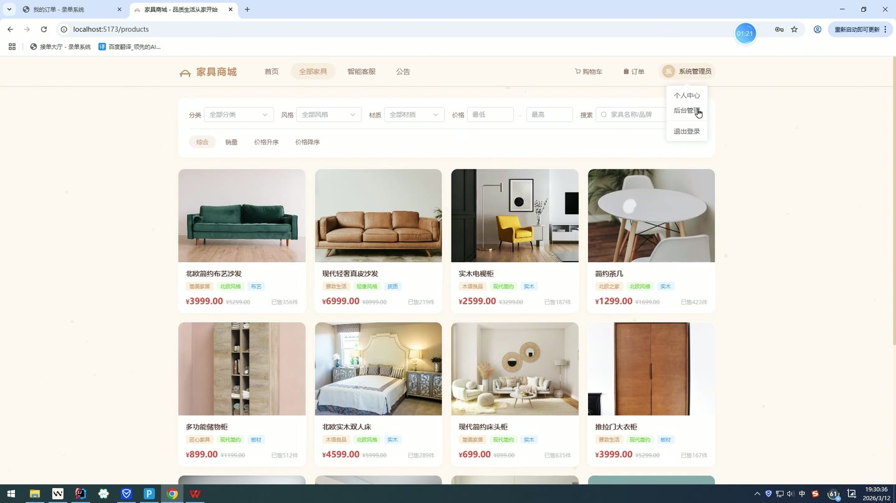
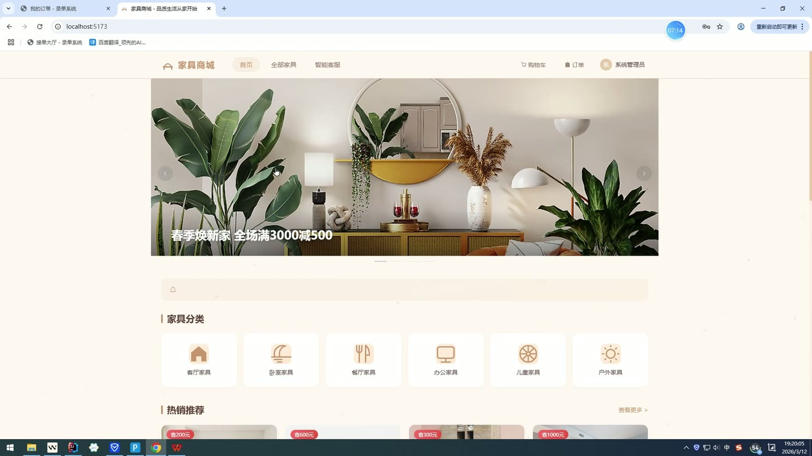
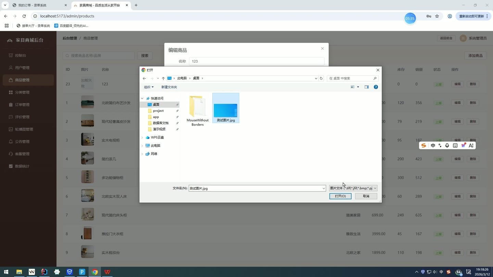
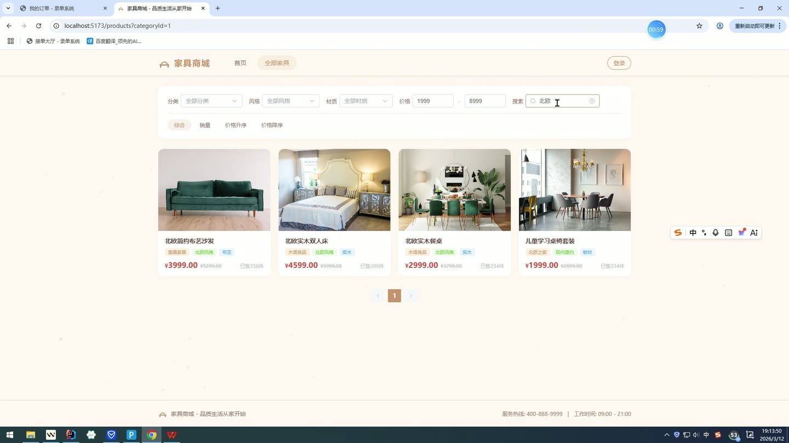
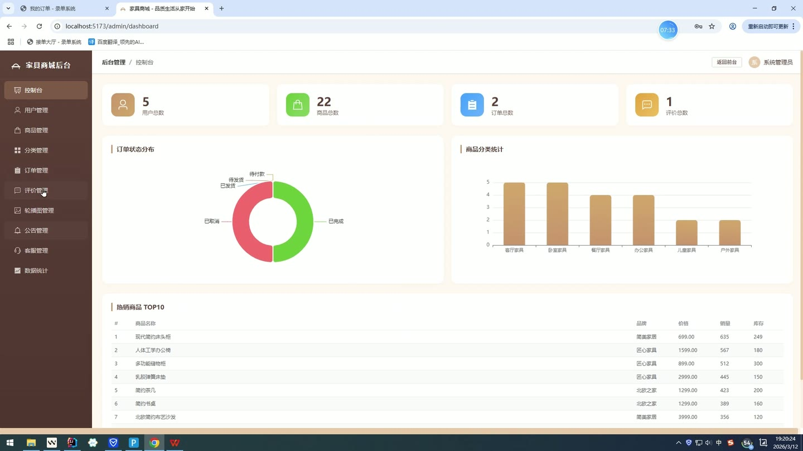
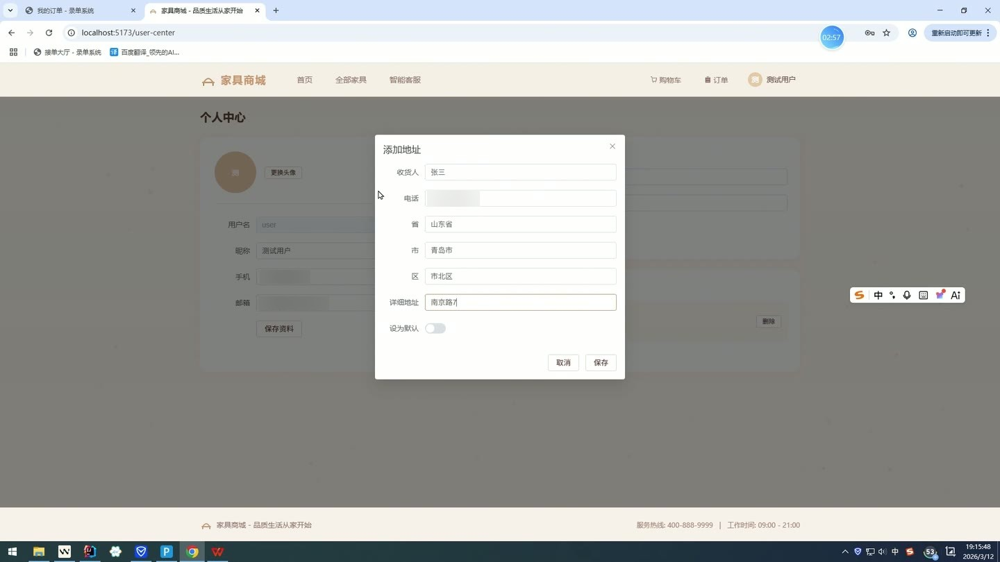

# (附文档)Springboot3+Vue3+MySQL 家具商城管理系统

**技术栈**：Springboot3、Vue3、MySQL

### 系统简介

本系统是一套基于 Spring Boot 3 + Vue 3 + MySQL 构建的家具商城管理系统，采用前后端分离架构。系统包含普通用户端和管理员端两大角色，覆盖商品浏览、购物车、订单管理、在线客服、内容管理等完整电商业务流程，并提供数据统计看板与智能 AI 客服功能。
 
### 核心功能
 
### 普通用户端

 
- 用户注册与登录：支持用户名/密码注册登录，登录后返回 JWT Token 用于身份校验 
- 商品浏览与筛选：按分类、品牌、材质、风格、价格区间筛选商品，支持按销量/价格/默认排序 
- 商品详情查看：查看商品主图、多图、价格、原价、库存、销量、描述、规格参数 
- 购物车管理：添加商品到购物车（支持修改数量）、查看购物车列表（含商品名/图片/单价/库存）、删除单条或批量删除购物车项 
- 创建订单：从购物车选中商品生成订单，填写收货地址和备注，自动生成订单号并扣减库存 
- 订单列表与详情：按状态（待付款/待发货/已发货/已完成/已取消）筛选订单，查看订单商品明细 
- 订单操作：支付订单（状态从待付款变为待发货）、取消订单（仅限未发货订单）、确认收货（状态变为已完成） 
- 收货地址管理：新增/编辑/删除收货地址，支持设置默认地址（自动清除其他默认地址） 
- 个人中心：查看/修改个人信息（昵称、手机、邮箱、头像），修改登录密码（需验证原密码） 
- 商品评价：对已购商品发表评价（评分、内容、图片），评价需管理员审核后展示 
- AI 智能客服：发送消息可自动回复（基于关键字匹配模拟或对接 DeepSeek API），支持转接人工客服 
- 公告查看：浏览管理员发布的有效公告列表 
- 轮播图查看：首页展示启用的轮播图（按排序字段排列）
 
### 管理员端

 
- 用户管理：查看用户列表（支持按用户名/昵称/手机号搜索）、编辑用户信息、启用/禁用用户账号 
- 商品管理：查看商品列表（支持按名称/品牌搜索）、新增商品、编辑商品信息（名称/分类/品牌/材质/风格/价格/库存/图片/描述等）、删除商品 
- 分类管理：查看分类列表（按排序字段升序）、新增/编辑/删除商品分类 
- 订单管理：查看所有订单（支持按订单号/状态筛选）、查看订单详情（含商品明细）、发货操作（将待发货订单标记为已发货） 
- 评价管理：查看所有评价（可按商品 ID 筛选）、删除评价、审核评价（启用/禁用显示） 
- 轮播图管理：查看轮播图列表（按排序字段升序）、新增/编辑/删除轮播图（标题/图片/链接/排序/状态） 
- 公告管理：查看公告列表（分页）、新增/编辑/删除公告（标题/内容/状态） 
- 客服消息管理：查看用户发起的客服消息列表（可按用户 ID 筛选）、回复用户消息（手动回复后标记为已回复） 
- 数据统计：查看总用户数、总商品数、总订单数、总评价数；各状态订单数量统计（待付款/待发货/已发货/已完成/已取消）；销量 Top10 商品；各分类商品数量统计
 
### 技术栈

 后端框架Spring Boot 3 ORMMyBatis-Plus 权限认证JWT（自定义拦截器） 密码加密BCryptPasswordEncoder 前端框架Vue 3 前端 UIElement Plus 路由管理Vue Router 构建工具Vite 数据库MySQL 文件上传MultipartFile 本地存储 AI 客服DeepSeek API / 关键字模拟回复
 
### 交付内容

 
- 后端完整源码 
- 前端完整源码 
- 数据库初始化脚本 
- 万字文档

## 界面展示

---

## 获取完整源码 + 万字文档

本仓库为项目介绍页。**完整前后端源码、数据库初始化脚本、万字项目文档**，请加微信 `kangkangcode`，或访问 [codekk.top](http://codekk.top) 获取。

可作课程设计 / 毕业设计参考，支持远程部署调试。